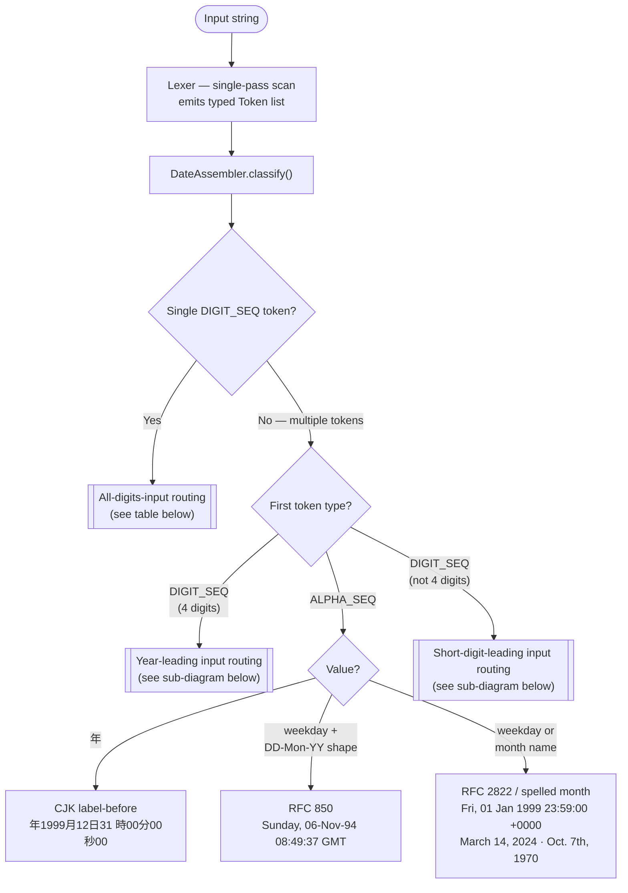
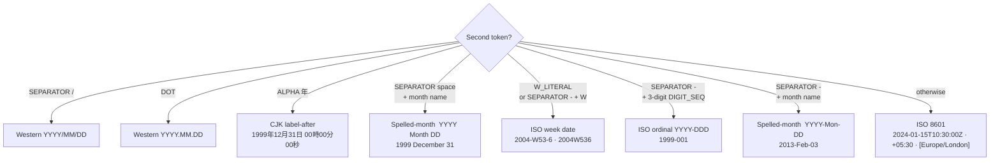
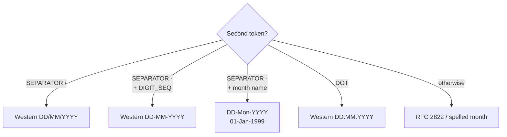

# Format Detection

This document explains how `jdk-omni-date-parser` identifies the format family of any input string, and traces a concrete example through every stage of the parsing pipeline.

> **Keeping this in sync**: run the `sync-format-diagram` skill after any change to
> `DateAssembler.classify()` routing logic.

---

## Format Detection Flowchart

The `DateAssembler.classify()` method routes each input to a format family using
the **shape** of the token stream — token types, digit lengths, and separator
characters — rather than regex matching against the raw string.



### All-digits-input routing

When the input consists of a single `DIGIT_SEQ` token, the format family is
determined by digit count:

| Digit count | Format family | Example |
|-------------|--------------|---------|
| 7 | ISO ordinal compact (YYYYddd) | `1999365` |
| 8 | Compact date (YYYYMMDD) | `19990101` |
| 10 | Unix timestamp (seconds) | `1332151919` |
| 12 | Compact datetime (YYYYMMDDHHmm) | `200501011200` |
| 13 | Unix timestamp (milliseconds) | `1384216367189` |
| 14 | Compact datetime (YYYYMMDDHHmmss) | `20140722105203` |
| 16 | Unix timestamp (microseconds) | `1384216367189000` |
| 19 | Unix timestamp (nanoseconds) | `1384216367189000000` |
| other | `DateParseException` | — |

### Year-leading input routing

When the first token is a 4-digit `DIGIT_SEQ`, the second token determines the
format family:



### Short-digit-leading input routing

When the first token is a `DIGIT_SEQ` with fewer than 4 digits, the second token
determines the format family:



### Token types emitted by the Lexer

| Token type | Matches |
|---|---|
| `DIGIT_SEQ` | One or more consecutive digits |
| `ALPHA_SEQ` | One or more consecutive letters (including CJK characters) |
| `SEPARATOR` | Whitespace, comma, slash `/`, dash `-`, `@`, or other delimiter |
| `COLON` | `:` |
| `DOT` | `.` |
| `SIGN` | `+` or `-` (only when in a position where a numeric sign is expected) |
| `T_LITERAL` | `T` between digit sequences (ISO 8601 date/time separator) |
| `W_LITERAL` | `W` between digit sequences (ISO 8601 week separator) |

---

## End-to-End Walkthrough

Tracing `"Fri, 01 Jan 1999 23:59:00 +0000"` through every stage:

### Stage 1 — Lexer

The Lexer scans left to right, emitting one token per character run:

```
Input: Fri, 01 Jan 1999 23:59:00 +0000
#    Type           Value       Pos
------------------------------------
0    ALPHA_SEQ      "Fri"       0
1    SEPARATOR      ","         3
2    SEPARATOR      " "         4
3    DIGIT_SEQ      "01"        5
4    SEPARATOR      " "         7
5    ALPHA_SEQ      "Jan"       8
6    SEPARATOR      " "         11
7    DIGIT_SEQ      "1999"      12
8    SEPARATOR      " "         16
9    DIGIT_SEQ      "23"        17
10   COLON          ":"         19
11   DIGIT_SEQ      "59"        20
12   COLON          ":"         22
13   DIGIT_SEQ      "00"        23
14   SEPARATOR      " "         25
15   SIGN           "+"         26
16   DIGIT_SEQ      "0000"      27
```

### Stage 2 — Format detection (DateAssembler)

`classify()` inspects the token stream:

1. **Multiple tokens** → check first token type
2. **Token 0 is `ALPHA_SEQ`** → check value
3. `"Fri"` is a weekday abbreviation → peek ahead: is this RFC 850?
   - RFC 850 shape: `weekday + DIGIT_SEQ + SEPARATOR("-") + ALPHA_SEQ(month)` — not present here
   - → route to **`classifyRfc2822Body()`**

### Stage 3 — Field extraction (RFC 2822 path)

`classifyRfc2822Body()` skips the weekday and trailing separators, then sees:

- Token 3: `DIGIT_SEQ "01"` → **day-first ordering** (DD Mon YYYY)
- `day = 1`
- Token 5: `ALPHA_SEQ "Jan"` → `MonthNames.lookup("Jan")` → `month = 1`
- Token 7: `DIGIT_SEQ "1999"` → `year = 1999`
- `parseTimeSection()`: tokens 9–13 → `hour = 23`, `minute = 59`, `second = 0`
- `parseAmPm()`: next token is `SIGN "+"` — no AM/PM present

### Stage 4 — Zone resolution (ZoneResolver)

`parseZoneSection()` sees token 15: `SIGN "+"` → numeric offset path

- Token 16: `DIGIT_SEQ "0000"` → `parseNumericOffset("+0000")` → `ZoneOffset.UTC`

### Stage 5 — Assembly

Fields are validated and assembled:

```
year=1999  month=1  day=1
hour=23  minute=59  second=0  nano=0
zone=ZoneOffset.UTC (+00:00)

→  ZonedDateTime: 1999-01-01T23:59:00Z
```
